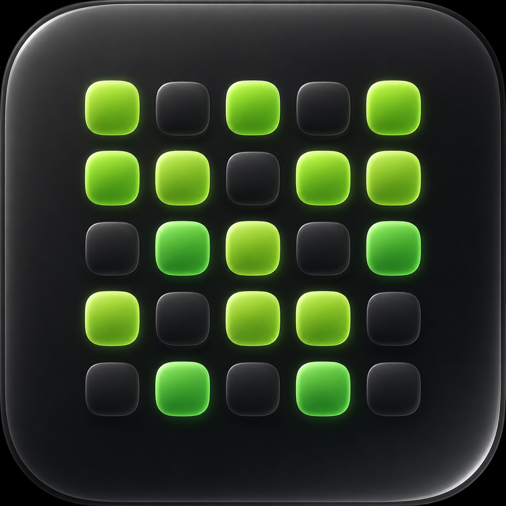
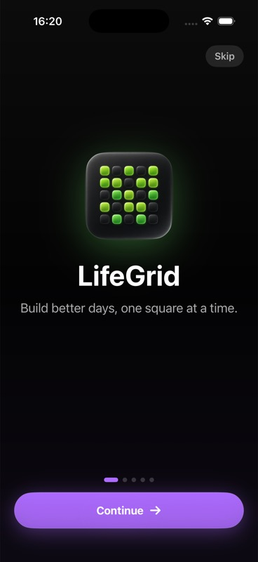
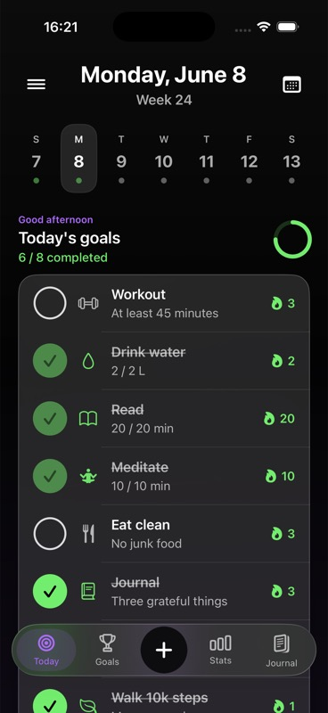
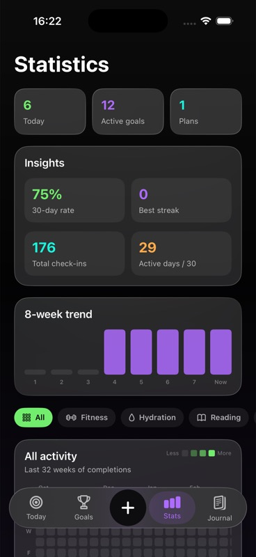
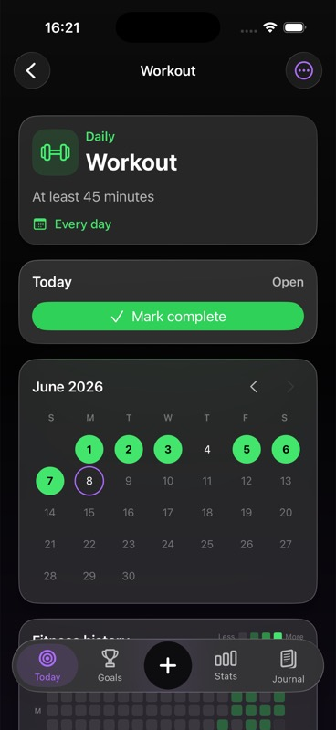
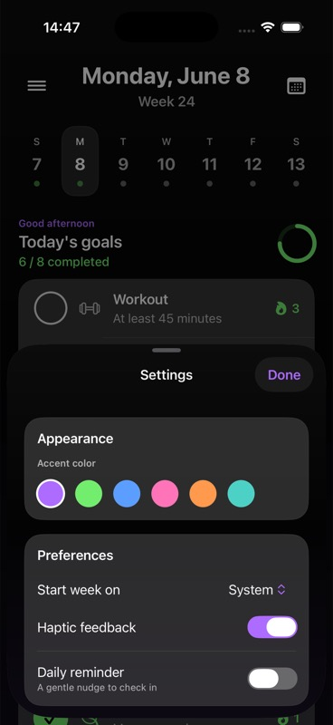

<p align="center">
  
</p>

<h1 align="center">LifeGrid</h1>

<p align="center"><b>Build better days, one square at a time.</b></p>

<p align="center">
  
  
  
  
</p>

LifeGrid is a private, **local-only** habit & goal tracker for iOS, built with SwiftUI. Check off daily habits, track one-time milestones, and commit to a focused 90-day challenge — with a GitHub-style contribution heatmap adapted to your habits. No account, no cloud, no tracking: everything stays on your device.

## Screenshots

| Onboarding | Today | Statistics | Goal detail | Settings |
|:---:|:---:|:---:|:---:|:---:|
|  |  |  |  |  |

## Features

- **Today** — a paged week strip, daily check-offs with streaks, one-time milestones, and an active 90-day plan card. View any past/future day.
- **Flexible scheduling** — habits can repeat every day or on specific weekdays (e.g. Mon/Wed/Fri); streaks and stats are schedule-aware.
- **Contribution heatmap** — a GitHub-style grid of your habit completions, with month/weekday labels and tap-to-inspect.
- **Statistics** — completion rate, best streak, total check-ins, an 8-week trend, and unlockable achievements.
- **Journal** — a quick daily mood + reflection log.
- **Reminders** — optional on-device daily notifications per habit, plus a global nudge, with a **"Mark done"** action right from the notification. No server involved.
- **Theming** — six accent colors that retint the whole app, choosable in Settings.
- **Preferences** — first day of the week and haptic feedback toggles.
- **Backup** — export/import all your data as a JSON file via the share sheet.
- **Localized** — English and Italian, following the device language (String Catalog).
- **Private by design** — 100% local JSON persistence. No account, no analytics, no network.
- **Liquid Glass** — native iOS 26 `glassEffect` with graceful `.ultraThinMaterial` fallbacks for iOS 18–25.

## Tech stack

- **SwiftUI** (iOS 18+), **Swift 6** with strict concurrency
- `@Observable` state, dependency injection via `@Environment`
- **Local persistence**: a single Codable `AppSnapshot` saved as JSON in the app's Documents directory
- **Localization**: `Localizable.xcstrings` String Catalog (EN/IT)
- **Notifications**: `UserNotifications` (`UNCalendarNotificationTrigger`)
- **Project generation**: [XcodeGen](https://github.com/yonsdesign/XcodeGen) (`project.yml`)

## Getting started

**Requirements:** macOS with Xcode 16+ (iOS 18 SDK; iOS 26 SDK to see Liquid Glass), and [XcodeGen](https://github.com/yonsdesign/XcodeGen).

```bash
# 1. Clone
git clone https://github.com/metaforismo/LifeGrid.git
cd LifeGrid

# 2. Install XcodeGen (if needed)
brew install xcodegen

# 3. Generate the Xcode project
xcodegen generate

# 4. Open and run
open LifeGrid.xcodeproj
```

In Xcode, select the **LifeGrid** scheme and run on an iOS Simulator. To run on a physical device, set your Apple Developer **Team** under *Signing & Capabilities* (the committed `project.yml` leaves it blank on purpose).

> The `.xcodeproj` is generated and git-ignored — always run `xcodegen generate` after pulling changes.

## Project structure

```
LifeGrid/
├── LifeGridApp.swift          # App entry point
├── AppRootView.swift          # Tab navigation + floating Liquid Glass tab bar
├── Models.swift               # Goal, LifePlan, JournalEntry, AppSettings, AppSnapshot
├── AppStore.swift             # @Observable store: state, persistence, insights
├── NotificationManager.swift  # Local reminder scheduling
├── DesignSystem.swift         # Theme tokens, panels, haptics, reusable components
├── DateViews.swift            # Header + paged week strip + date picker
├── TodayView.swift            # Today screen
├── GoalComponents.swift       # Goal rows, badges, plan card
├── OnboardingView.swift       # Animated multi-screen onboarding
├── GoalsView.swift            # Goals browser
├── StatsView.swift            # Statistics, insights, achievements
├── HeatmapViews.swift         # Contribution heatmap + 90-day grid
├── JournalView.swift          # Journal
├── CreateGoalView.swift       # Create goal / plan
├── GoalDetailView.swift       # Goal detail + edit
├── PlanDetailView.swift       # Plan detail
├── SettingsView.swift         # Appearance, preferences, data, about
└── Localizable.xcstrings      # EN/IT translations
LifeGridTests/                 # AppStore unit tests
```

## Tests

```bash
xcodebuild test -scheme LifeGrid -destination 'platform=iOS Simulator,name=iPhone 17 Pro'
```

The `LifeGridTests` target covers the store: completion/streak logic, persistence round-trips, settings, backup export/import, and data migration.

## Roadmap

- Home Screen / Lock Screen widgets (WidgetKit)
- Apple Health integration (auto-complete from steps / workouts)
- Reorder & categorize goals
- Full Dynamic Type & VoiceOver pass

Recently shipped: animated onboarding with branding, accent theming, JSON backup, weekday scheduling, a monthly calendar in goal detail, an all-done celebration, and a "Mark done" notification action.

## Contributing

Issues and pull requests are welcome. Please run `xcodegen generate`, keep the build warning-free, and add new user-facing strings to `Localizable.xcstrings` (with Italian translations).

## License

[MIT](LICENSE) © 2026 Francesco Giannicola
